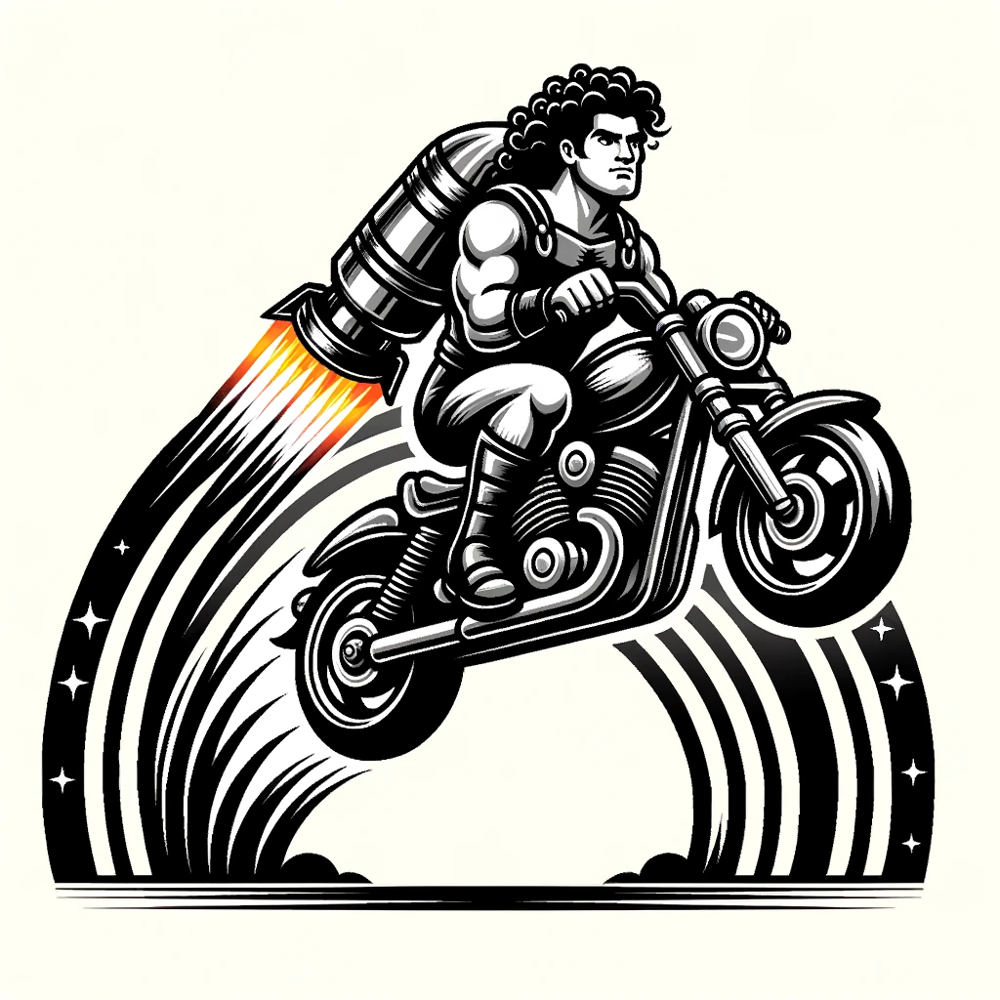

# KKB

It's just a fact: _**<u>K</u>ool <u>K</u>ids have nice <u>B</u>ackgrounds**_.

<p align="center">
  
</p>

### Install

```bash
cargo install kkb
```

Ensure you have OpenCV installed. It can be finiky - _I wish it wasn't_.

### Usage

Make your background beautiful.

```bash
kkb
```

Describe your work of art.

```bash
kkb "Hercules riding a motorcycle over a rainbow, with a jetpack"
```

### Tech

-   Image generation: [OpenAI's DALL-E 3](https://openai.com/dall-e-3)
-   Image super resolution: [OpenCV](https://github.com/twistedfall/opencv-rust)

### FAQ

-   [Macos] Can't install OpenCV? Try `brew install opencv`.

    1.  You may need to [reinstall homebrew](https://github.com/Genymobile/scrcpy/issues/2128#issuecomment-958046872) if you recently updated your OS.
    2.  You may need to set this library path:

    ```bash
    export DYLD_FALLBACK_LIBRARY_PATH="$(xcode-select --print-path)/Toolchains/XcodeDefault.xctoolchain/usr/lib/"
    ```
